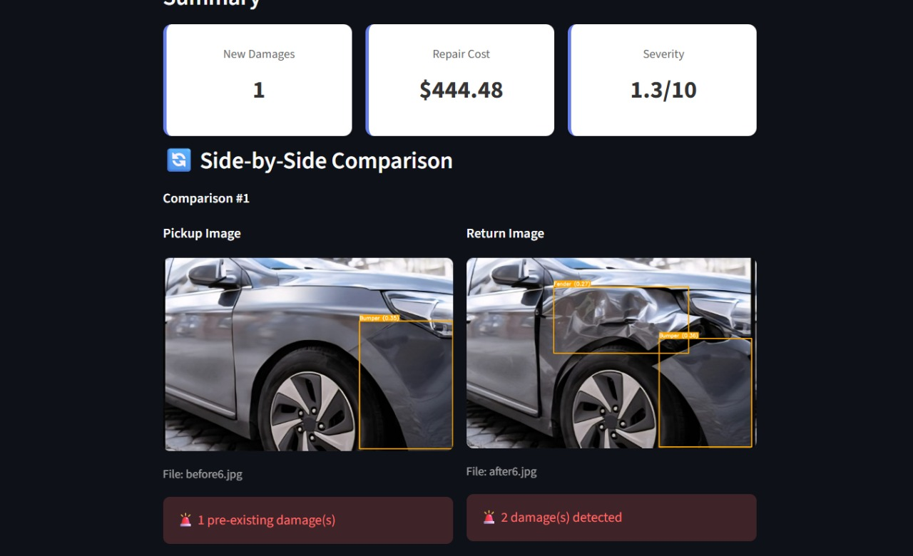

# 🚗 Vehicle Damage Assessment System

**AI-powered rental vehicle inspection — automatically detects new damage by comparing pickup and return photos, then estimates repair cost, no manual inspection required.**

[](https://www.python.org/)
[](https://fastapi.tiangolo.com/)
[](https://github.com/ultralytics/ultralytics)
[](https://react.dev/)
[](https://vitejs.dev/)
[](https://streamlit.io/)

---

## Why this exists

Rental car companies lose money and time whenever damage is missed or disputed at hand-off. Manual walk-around inspections are slow, inconsistent between inspectors, and easy to argue with. This project replaces that manual step with a computer-vision pipeline: upload the **pickup** photos and the **return** photos, and the system tells you exactly what's new, how confident it is, and roughly what it will cost to fix — in seconds.

## What it does

1. **Detects** vehicle parts and damage types (scratch, dent, crack, broken light, and parts like bonnet, fender, door, bumper, windshield, headlight, taillight, mirror, quarter panel, roof, trunk) in every uploaded photo using a custom-trained **YOLOv8** object detection model.
2. **Deduplicates** overlapping detections from the same image using IoU-based **Non-Maximum Suppression**, so one dent isn't reported three times.
3. **Compares** the pickup set against the return set using bounding-box overlap + damage-type matching to isolate only *new* damage — pre-existing wear is filtered out automatically.
4. **Estimates cost** per damage using a weighted model: base repair cost for the part × a confidence-derived severity multiplier × a bounding-box-area multiplier (capped at 2×), so a small low-confidence scratch is priced very differently from a large, certain dent.
5. **Scores severity** on a 0–10 scale and renders annotated, colour-coded bounding-box images plus a downloadable report.

## Sample output

The model detecting and annotating damage on a return-inspection photo:

<p align="center">
  
</p>

## Architecture

Two interchangeable frontends talk to the same FastAPI/YOLO backend:

```
┌─────────────────────┐      ┌─────────────────────┐
│   React + Vite SPA   │      │   Streamlit          │
│   (production UI)    │      │   (rapid-review UI)  │
└──────────┬───────────┘      └──────────┬───────────┘
           │        REST / multipart-form │
           └───────────────┬──────────────┘
                            ▼
                 ┌─────────────────────────┐
                 │  FastAPI backend        │
                 │  (main.py)              │
                 │  • image ingestion      │
                 │  • YOLOv8 inference     │
                 │  • NMS deduplication    │
                 │  • pickup/return diff   │
                 │  • cost & severity calc │
                 │  • OpenCV visualization │
                 └───────────┬─────────────┘
                             ▼
                  ┌─────────────────────┐
                  │  models/best.pt     │
                  │  (custom YOLOv8     │
                  │   damage model)     │
                  └─────────────────────┘
```

## Tech stack

| Layer | Choice | Why |
|---|---|---|
| Object detection | YOLOv8 (Ultralytics), custom-trained weights (`models/best.pt`) | Real-time, high-accuracy detection of small damage regions and vehicle parts |
| Backend API | FastAPI + Uvicorn | Async, typed, auto-generated OpenAPI docs at `/docs` |
| Image processing | OpenCV, NumPy | Decoding, bounding-box drawing, colour-coded annotation |
| Production frontend | React 18 + Vite | Fast SPA build, drag-and-drop uploads, deployable static bundle |
| Rapid-iteration UI | Streamlit | Same API, zero-build dashboard for quick internal review/demos |
| HTTP client | Axios | Typed API layer with environment-based base URL (`VITE_API_URL`) |

## Key engineering details

- **New-damage isolation, not just detection** — the core value isn't "find scratches," it's "find scratches that weren't there before," via `compare_damages()` matching type + IoU overlap between pickup and return sets.
- **Confidence-aware pricing** — `estimate_detailed_cost()` scales repair cost by detection confidence and bounding-box area so noisy low-confidence detections don't inflate the estimate.
- **Duplicate-safe inference** — `apply_non_maximum_suppression()` runs before comparison so multi-label overlapping boxes collapse into a single, highest-confidence damage entry.
- **Two working UIs, one contract** — the React app and the Streamlit dashboard both consume the identical `/api/compare-with-visualization` response shape, proving the API is a clean, reusable contract rather than UI-coupled logic.
- **Visual proof, not just JSON** — annotated images are generated server-side with OpenCV and returned as base64 so the frontend never has to re-implement drawing logic.

## API reference

Interactive Swagger docs are available at `/docs` once the backend is running. Key endpoints:

| Method | Endpoint | Purpose |
|---|---|---|
| `GET` | `/health` | Liveness check |
| `POST` | `/api/assess-damage` | Compare pickup vs. return images, return a JSON damage report |
| `POST` | `/api/compare-with-visualization` | Same as above, plus base64 annotated images for both sets |
| `POST` | `/api/analyze-single` | Detect damage in a single image |
| `POST` | `/api/analyze-image-with-boxes` | Detect damage in a single image and return the annotated version |

## Getting started

### 1. Backend (FastAPI + YOLOv8)

```bash
python -m venv .venv
.venv\Scripts\activate          # Windows
pip install -r requirements.txt

python main.py                  # runs on http://localhost:8000
```

The API expects a trained weights file at `models/best.pt`.

### 2a. React frontend

```bash
npm install
npm run dev                     # runs on http://localhost:5173
```

Set `VITE_API_URL` in `.env` (or `.env.production` for a deployed build) if the backend isn't on `localhost:8000`.

### 2b. Streamlit dashboard (alternative UI)

```bash
pip install streamlit
streamlit run streamlit_app.py
```

Useful for quickly demoing or reviewing results without building the frontend.

## Project structure

```
├── main.py                  # FastAPI backend: inference, NMS, comparison, cost engine
├── streamlit_app.py          # Streamlit dashboard (alternative frontend)
├── models/best.pt            # Custom-trained YOLOv8 damage-detection weights
├── src/                      # React + Vite frontend
│   ├── App.jsx
│   ├── components/           # ImageUpload, ResultsDisplay
│   └── services/api.js       # Axios client for the backend API
├── data/
│   ├── test_images/          # Sample before/after images
│   └── output/                # Example annotated detection output
└── requirements.txt
```

## Possible next steps

- Persist assessment history to a database (mysql-connector is already a dependency) instead of returning reports in-memory only.
- Auth + per-rental-agreement tracking so pickup/return sets are tied to a booking ID automatically.
- Replace the text-based report with a formatted PDF export.

## Author

**Mohamad Slim**
📧 tslim865@gmail.com
